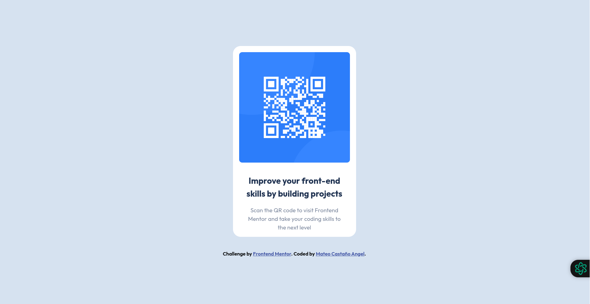

# Frontend Mentor - QR code component solution

This is a solution to the [QR code component challenge on Frontend Mentor](https://www.frontendmentor.io/challenges/qr-code-component-iux_sIO_H). Frontend Mentor challenges help you improve your coding skills by building realistic projects. 

## Table of contents

- [Overview](#overview)
  - [Screenshot](#screenshot)
  - [Links](#links)
- [My process](#my-process)
  - [Built with](#built-with)
  - [What I learned](#what-i-learned)
  - [Continued development](#continued-development)
- [Author](#author)

## Overview

### Screenshot

 

### Links

- Solution URL: [Solution](https://res.cloudinary.com/dz209s6jk/image/upload/v1642681473/Challenges/lzfaukzhigbavv5sc26b.jpg)
- Live Site URL: [Live site URL](https://codeqrfem.netlify.app/)

## My process

### Built with

- Semantic HTML5 markup
- CSS custom properties
- Flexbox
- Mobile-first workflow

### What I learned


In this project, more than learning something new, I was able to practice some things that I have learned over time, although it is not the most polished semantically/structurally, I was satisfied with the results....what do you think?

```html
<main>
      <section class="card">
        <figure class="card_img">
          
        </figure>
        <div class="card_caption">
          <h1>Improve your front-end skills by building projects</h1>
          <p>Scan the QR code to visit Frontend Mentor and take your coding skills to the next level</p>
        </div>
      </section>
    </main>
```
### Continued development

I would like to emphasize more on the use of classes and selectors, as well as improve the semantics of my html documents.

## Author

- GitHub - [@teocastano98](https://www.your-site.com)
- Frontend Mentor - [@teocastano98](https://www.frontendmentor.io/profile/teocastano98)
- Instagram - [@teo.dev98](https://www.instagram.com/teo.dev98?igsh=MWtuZnNob2l6OGl2aw==)
- TikTok - [@teo.dev98](https://www.tiktok.com/@teo.dev98?_t=8mEfZr4EsmT&_r=1)

##
